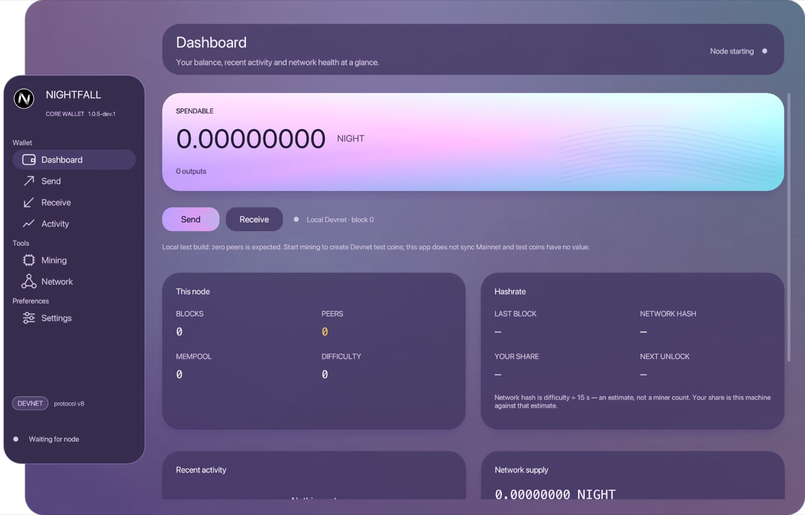

<div align="center">


# NIGHTFALLCOIN

**Money that refuses to snitch.**

No company, no premine, no admin key. Your amounts stay hidden, your addresses
never touch the chain, and hidden inflation isn't something you take on trust —
*the chain rules it out*, block by block.

[](https://github.com/Instinctes/nightfall/actions/workflows/ci.yml)
[](https://github.com/Instinctes/nightfall/releases/latest)
[](docs/SPEC.md)
[](#license)
[](#honest-status)
[](https://discord.gg/Wj6pTNmVEr)

**[Download](https://nightfallcoin.org)** ·
[Web wallet](https://nightfallcoin.org/wallet/) ·
[Start mining](#start-mining) ·
[Discord](https://discord.gg/Wj6pTNmVEr) ·
[Emission schedule](https://nightfallcoin.org/emission/) ·
[Protocol spec](docs/SPEC.md) ·
[Security review (v8)](docs/AUDIT-2026-08-16.md) ·
[v4 audit](docs/AUDIT-2026-08-12.md)

<br>



<sub>The balance and the mining figures are blanked on purpose. What one
operator holds is nobody's business — which is the entire point. Everything
still visible is a public chain fact: height, peers, difficulty, network
hashrate, total supply, and the proof that no coin exists which was never
mined.</sub>

</div>

---

> [!IMPORTANT]
> **v0.7.0 is a new chain.** Genesis `061a052d…`, protocol v8, wire v6,
> magic `NFL2`. Coins mined on `c8614333…` (every 0.6.x wallet) **do not
> exist here.** That is deliberate. Why, and the full list of buried
> genesis hashes: [docs/HISTORY.md](docs/HISTORY.md) and
> [docs/RESET.md](docs/RESET.md).
>
> 0.6.x cannot handshake. Delete nothing — old data stays in
> `nightfall/mainnet/`. This chain writes `nightfall/mainnet/n8/`.

## Start mining

Download a build from **[nightfallcoin.org](https://nightfallcoin.org)** or the
[releases page](https://github.com/Instinctes/nightfall/releases/latest), open
it, and press **Start mining**. The wallet finds the network by itself.

<details>
<summary><b>macOS: the first launch is blocked</b></summary>

The builds are not code-signed, so macOS refuses a normal double-click.
Right-click the app → **Open** → **Open**. Once only.

That warning is real and you should not dismiss it lightly for any download.
Verify the checksum first if you want the assurance that the signature would
have given you:

```bash
shasum -a 256 -c SHA256SUMS-0.9.2.txt
```
</details>

<details>
<summary><b>Windows: SmartScreen warns about an unknown publisher</b></summary>

Same reason — no code signing certificate. **More info → Run anyway**, if you
trust the source. The Windows binaries are built by
[a published workflow](.github/workflows/release.yml) on GitHub's runners
rather than on a laptop, and their checksums are generated by that workflow.

```powershell
certutil -hashfile nightfall-core-0.9.2-windows-x64.exe SHA256
```
</details>

<details>
<summary><b>Build it yourself instead</b></summary>

```bash
git clone https://github.com/Instinctes/nightfall && cd nightfall
cargo build --release -p nightfall-core
./target/release/nightfall-core --network mainnet
```

Needs a recent stable Rust. On Linux you also need the GUI libraries listed in
[`.github/workflows/ci.yml`](.github/workflows/ci.yml).
</details>

<details>
<summary><b>Linux: headless node</b></summary>

Read the installer, then run it. Do not pipe curl into a shell.

```bash
curl -fsSL https://nightfallcoin.org/scripts/install-node-linux.sh -o install-node.sh
less install-node.sh
sudo bash install-node.sh          # relay only
sudo bash install-node.sh --mine   # also mines; holds a key
```

A public seed (no keys, TCP 17891 open) is
[`scripts/install-seed-node-linux.sh`](scripts/install-seed-node-linux.sh).
Both check genesis `061a052d…` before they enable the service.

Prebuilt `nightfalld` / `nightfall-wallet` / `nightfall-core` for Linux
x64 are attached to the [release](https://github.com/Instinctes/nightfall/releases/latest).
Core needs GTK.
</details>

**Write down your recovery phrase before you mine anything.** Settings →
Backup shows 24 words. They are the only way back to your coins — there is no
reset, no support desk, and nobody who can help.

Mined coins show as *unlocking* for 1,440 blocks (~6 hours) before they can be
spent. They are already yours; the delay protects against chain
reorganisations.

### What you should expect

| | |
|--|--|
| Block time | 15 seconds |
| Block reward | 6 NIGHT, halving every 7,500,000 blocks |
| Algorithm | Argon2id, 32 MiB per hash — CPU only, no GPU or ASIC advantage |
| Typical laptop | a few hundred hashes per second |

The wallet warns you in orange if it is mining with **no peers**, and holds
mining back while it is still catching up. Take the warning seriously: two
miners who never meet build two separate chains, and when they finally connect,
everything mined on the lighter one is gone. It has happened on this network
three times.

---

## What makes this different

Most privacy coins ask you to trust that nobody is quietly printing money
behind the confidentiality. Nightfall does not ask. Every node checks one
equation across the whole chain:

```
Σ UTXO − Σ kernel_excess  =  (minted − burned) · G
```

It balances only if not a single coin was ever created from nothing. Inflation
cannot hide inside it — it breaks the equation, and every node sees the break.

```console
$ nightfalld --network mainnet status | grep supply_proof
supply_proof... OK — Σ UTXO − Σ excess == circulating·G
```

Four pieces make that sound:

| Piece | What it prevents |
|-------|------------------|
| **Bulletproof range proofs** on every output | negative amounts minting value |
| **Schnorr excess signature** over generator `H` | value created out of thin air |
| **UTXO membership + one-time key signature** | spending outputs you do not own |
| **Per-output sender signature** | a relay corrupting a payload and destroying funds |

---

## NIGHT ↔ BTC atomic swaps (experimental, testnet only)

Trade Bitcoin for NIGHT directly with another person. No exchange, no
custodian, no account, no server — the two wallets pass blocks of text by
whatever channel the two people already trust.

Bitcoin side: P2WSH 2-of-2 with an ECDSA adaptor signature.
NIGHT side: a shared stealth address.

They are linked by a scalar that becomes public the moment the Bitcoin is
taken, and that scalar is what opens the NIGHT. Neither half can be taken
alone.

**Disabled on mainnet, in code rather than in a warning.** The cross-curve
proof rests on our own Ristretto leaf inside an otherwise reviewed
combinator crate, and nobody outside this project has looked at that leaf.
A label gets read past; the gate does not. Testnet and devnet are open,
and that is where it is meant to be exercised.

**There is no NIGHT refund.** If the other side cancels and never refunds,
NIGHT locked in that swap is stuck forever. You can take their Bitcoin as
compensation after the second timelock. You cannot get the NIGHT back.

The Bitcoin half is not a claim we make about ourselves — it is checked
against Bitcoin Core on regtest: the redeem is accepted, the secret is
recovered from the confirmed witness, and the cancel and punish paths are
refused before their timelocks and accepted after. The node will also
happily accept a redeem sent too late, so the margin that refuses it is
ours, and it is the only thing between a user and a race they lose.

| | |
|--|--|
| [docs/SWAP.md](docs/SWAP.md) | How to run one |
| [docs/SWAP-LOSS.md](docs/SWAP-LOSS.md) | What you can lose, and when |
| [docs/SWAP-ATTACKS.md](docs/SWAP-ATTACKS.md) | What we attacked — and what we did **not** test |

Read the third one first.

Talking to `bitcoind` needs `-txindex=1`. Without it, confirmed locks look
missing to the wallet and a swap goes blind while its deadline runs out.

---

## Privacy, precisely

**What is true today:**

- **Amounts are Pedersen commitments**, not numbers. Nothing on chain says what moved.
- **No addresses on chain.** Every payment derives a fresh one-time key from an ECDH shared secret, so two payments to the same address share no visible field.
- **View keys are real.** `nfview1…` finds and decrypts everything you receive and is structurally incapable of spending — enforced by the type system, not by convention.
- **Encrypted memos**, padded to constant length so ciphertext size leaks nothing.
- **Blocks dissolve transactions.** Every payment in a block is merged into one flat, sorted set of inputs, outputs and kernels. An observer cannot tell which input paid which output.
- **No admin keys.** No mint authority, no freeze, no blacklist, no premine — enforced in code by `GenesisConfig::assert_fair()`.

**What is not true yet:**

- **The transaction graph is obscured, not erased.** Spent outputs stay visible. Cut-through would delete the per-input signature that makes non-interactive payments safe; the two are mutually exclusive and we chose payments that work without both parties online.
- **Network-layer privacy is stem/fluff, not magic.** A new transaction is forwarded to one random peer first (Dandelion-class). Older nodes still fluff immediately. Tor is optional (`--proxy 127.0.0.1:9050` / `NIGHTFALL_PROXY`). See [docs/PRIVACY.md](docs/PRIVACY.md).
- **Not audited by anyone outside the project.** See [Honest status](#honest-status).
- **A checkpoint skips re-hashing old proof of work.** You are trusting the
  binary's pin. Off with `NIGHTFALL_NO_ASSUME_VALID=1`.

---

## Economics

| | |
|--|--|
| Max supply | **90,000,000 NIGHT** — the curve terminates 0.75 short, at 89,999,999.25, because each halving truncates to whole darks |
| Premine | **0** |
| Team / VC allocation | **0** |
| Block reward | 6 NIGHT, halving every 7,500,000 blocks (~3.56 years) |
| 89 M minted | ~23.4 years |
| Subsidy reaches zero | after 30 halvings — 225,000,000 blocks, ~107 years |
| Tail emission | **none** |
| Fees | burned during the subsidy; **to the miner after** |
| Coinbase maturity | 1,440 blocks |

Every coin that will ever exist has to be mined. See
[FAIR_LAUNCH.md](FAIR_LAUNCH.md) for the rules this commits the project to.

---

## Mining, in detail

Nighthash-v2 is **Argon2id**: one hash needs 32 MiB of randomly addressed
memory. Purpose-built hardware would need that much fast RAM per parallel core,
which is where ASIC economics stop working.

```console
# measured on an Apple M3 Pro, 10 mining threads
devnet    1 MiB    0.83 ms/hash   22,268 H/s
testnet   8 MiB    2.48 ms/hash    2,351 H/s
mainnet  32 MiB   11.17 ms/hash      489 H/s
```

Reproduce on your own hardware:

```bash
cargo run --release -p nightfall-crypto --example powbench
```

Memory-hard proofs are symmetric — verifying costs the same as one mining
attempt. That is the price of ASIC resistance, and it is why a phone cannot
validate the chain and why a node records a local validation marker rather than
re-hashing its own history on every restart.

Releases also pin a historical mainnet hash (`CHECKPOINTS`, currently
height 25,000). Below that pin, proof of work is not re-hashed on replay
— linkage and the pin still are. That is Bitcoin's `assumevalid`: a
trust assumption on whoever built the binary. `NIGHTFALL_NO_ASSUME_VALID=1`
turns it off. Reproduce a pin with
`cargo run --release -p nightfall-node --example checkpoint -- <height>`.
See [docs/SPEC.md](docs/SPEC.md) §2.5.

---

## Running a node

```bash
cargo build --release -p nightfall-node -p nightfall-wallet

./target/release/nightfalld --network mainnet init
./target/release/nightfalld --network mainnet run
# laptop: drop bodies older than 500 blocks (UTXO stays)
./target/release/nightfalld --network mainnet run --prune
```

`--prune` is for machines that should not keep the whole chain in RAM.
Seeds that serve IBD or the phone/web light API **must not** prune —
those clients scan from genesis. A pruned Core wallet cannot rescan from
birth on this machine; use the light API or Settings → Resync chain
(downloads an archive from a seed). Same trust class as Bitcoin prune:
you trust *this node's* disk, not a stranger's UTXO file.

### How much disk

A block costs **1.41 KiB** on disk, so a year of 15-second blocks is under
3 GB even with every block full. It used to be 5.10 KiB, because JSON
renders a 32-byte hash as an array of decimal numbers and the chain was
three quarters punctuation.

New datadirs use the compact format. An existing one keeps its
`blocks.jsonl` until you convert it, which takes about a second and
verifies every block hash before it swaps anything:

```bash
./target/release/nightfalld --network mainnet migrate-storage
```

Storage only — block hashes are computed over raw bytes and the wire
format is unchanged, so a converted node and an unconverted node hold
the identical chain and peer normally. The old file is kept as
`blocks.jsonl.pre-binary`. **A 0.7.x node cannot read a converted
datadir** and will resync from genesis, so treat the conversion as
one-way unless you rename that file back.

Builds from `main` dial `seed.nightfallcoin.org:17891` on startup and need no
configuration. Each node advertises its listening port in the handshake and
peers exchange the addresses they know, so one working connection finds the
rest of the network. Known addresses are written to `peers.json` in the data
directory and reloaded on the next start.

**Running a seed node yourself genuinely helps.** No seed can forge a block,
hide one, or change the rules — every node validates independently — but if the
only one is down, new installs find nobody. `scripts/install-seed-node-linux.sh`
sets one up on a VPS; see [docs/MAINNET.md](docs/MAINNET.md) §3.

### Command-line wallet

```bash
W="./target/release/nightfall-wallet --network mainnet --seed-file alice.seed"

$W init                 # creates keys, prints the recovery phrase
$W address              # your receive address
$W sync
$W balance
$W send --to nf1... --amount 10 --memo "invoice 42"
$W export-view-key      # watch-only: sees everything, spends nothing
$W prove-output --commit <hex>   # prove one payment, not the whole wallet
$W verify-receipt --file r.json
$W verify-supply        # re-prove the whole money supply yourself
```

### Devnet, for development

```bash
./target/release/nightfalld --network devnet run --mine \
    --listen 127.0.0.1:17893 --rpc-listen 127.0.0.1:17883
```

Low difficulty, 10-block coinbase maturity, cheap PoW parameters — the spend
path is testable in seconds.

---

## Architecture

```
crates/
├── nightfall-types      constants, network ids, PoW and emission parameters
├── nightfall-crypto     commitments, range proofs, Schnorr, kernels,
│                        stealth outputs, key hierarchy, Nighthash-v2
├── nightfall-ledger     transactions, UTXO set, block aggregation,
│                        the supply invariant
├── nightfall-consensus  block structure, LWMA difficulty, chain selection
├── nightfall-storage    append-only persistence, reorg-safe
├── nightfall-p2p        wire protocol, handshake, peer exchange
├── nightfall-node       node runtime, mining loop, JSON-RPC
├── nightfall-wallet     scanning, coin selection, spending (lib + CLI)
├── nightfall-core       desktop wallet (egui)
├── nightfall-mobile     UniFFI bindings for the Android / iOS apps
└── nightfall-web        wasm-bindgen bindings for the browser wallet
```

No `unsafe` in the consensus path. Cryptography comes from `curve25519-dalek`,
`bulletproofs`, `argon2`, `blake3` and `chacha20poly1305` — no hand-rolled
primitives.

---

## Testing

```bash
cargo test --workspace
```

210 tests. The ones that matter most:

| Suite | What it locks down |
|-------|--------------------|
| `nightfall-ledger/tests/exploit_regression.rs` | the six attacks that worked against protocol v4, each of which must now fail |
| `nightfall-ledger/tests/ledger_flow.rs` | coinbase, transfer, fee burn, double spend, maturity, atomicity, supply invariant |
| `nightfall-consensus/tests/chain_rules.rs` | work-based fork choice, time-warp resistance, reorg bounds, emission curve, and that raising the wire version never moves the genesis |
| `nightfall-node/tests/reorg_fetch.rs` | how much of a peer's chain is pulled before judging it — a fixed cap once split the network at exactly 2,000 blocks |
| `nightfall-storage/tests/reorg_persistence.rs` | a chain saved after a reorg must reload — found by running two miners against each other |

**Do not weaken `exploit_regression.rs`.** Every test in it is the inverse of a
proof-of-concept that once worked against a real build.

Worth saying plainly: **no test starts two nodes.** Every networking fault this
project has had — a freeze, a fork, the 2,000-block wall, a handshake checked in
only one direction — was found by real nodes disagreeing, while the suite
passed. A multi-node harness is the most valuable thing anyone could contribute.

---

## Honest status

**This is pre-launch software that has not been reviewed by anyone outside the
project. Do not put value on it that you cannot afford to lose entirely.**

Protocol v4 shipped a balance proof that was a tautology: it computed a value
from public data, recomputed the same value, and compared it to itself. It
could not fail. Anyone could have minted unlimited NIGHT, and the recipient of
every payment was published in cleartext. We found it, wrote it up in full,
threw the chain away and started over. The whole analysis, including working
exploits, is in [docs/AUDIT-2026-08-12.md](docs/AUDIT-2026-08-12.md). The live
chain is reviewed in [docs/AUDIT-2026-08-16.md](docs/AUDIT-2026-08-16.md) — including
the parts that are embarrassing.

The chain was reset at v6 to add view tags to the output format while that was
still free, and again at **v7** after two networking faults — a mining hold-off
that deadlocked across a fork, and wallet accounting that never un-did what a
reorg had undone. Neither made a block invalid. They made the chain
untrustworthy, which is worse, because nothing reported anything wrong.

Before this carries real value it needs:

1. **An independent audit.** The cryptography was written and reviewed by the same party. That is a conflict of interest, and passing tests are not a substitute — every fault that has bitten this network so far was found by real nodes disagreeing, while the suite passed.
2. **A larger network.** A young chain with little hashrate can be out-mined. True of every new proof-of-work network.
3. **Full Dandelion++** (separate stem graph). Stem/fluff over the existing `Tx` message is already in.
4. **Cut-through**, or a spend-authorisation scheme that does not need a per-input signature.

If you find something wrong, see [SECURITY.md](SECURITY.md). Private
vulnerability reporting is enabled on this repository.

---

## Documentation

| | |
|--|--|
| [docs/SPEC.md](docs/SPEC.md) | Protocol v8 in full |
| [docs/AUDIT-2026-08-16.md](docs/AUDIT-2026-08-16.md) | Current internal review of v8 (not independent) |
| [docs/AUDIT-2026-08-12.md](docs/AUDIT-2026-08-12.md) | Security audit of v4 — history |
| [docs/MAINNET.md](docs/MAINNET.md) | Operator guide, seed node setup |
| [docs/PRIVACY.md](docs/PRIVACY.md) | What is hidden, Tor, receipts |
| [docs/GETTING-NIGHT.md](docs/GETTING-NIGHT.md) | How a price forms — nobody sets one |
| [docs/HISTORY.md](docs/HISTORY.md) | Every buried genesis, including this reset |
| [docs/RESET.md](docs/RESET.md) | What v8 changed and what we do not claim |
| [docs/SWAP.md](docs/SWAP.md) | NIGHT ↔ BTC swaps — operator notes |
| [docs/SWAP-LOSS.md](docs/SWAP-LOSS.md) | Swap loss cases, including the one with no way back |
| [docs/SWAP-ATTACKS.md](docs/SWAP-ATTACKS.md) | Swap attacks run, and the gaps left open |
| [docs/MOBILE.md](docs/MOBILE.md) | iOS, Android and browser wallet |
| [mobile/README.md](mobile/README.md) | Sideload Android APK / EU iOS install |
| [docs/DECISIONS.md](docs/DECISIONS.md) | Every design decision and why |
| [docs/ATTRIBUTES.md](docs/ATTRIBUTES.md) | Locked product attributes, with the gaps marked |
| [MANIFESTO.md](MANIFESTO.md) | Why this exists |
| [FAIR_LAUNCH.md](FAIR_LAUNCH.md) | Fair launch rules |

## Community

**[Discord](https://discord.gg/Wj6pTNmVEr)** — mining and node help, releases,
and the place where problems get reported first. English is the working
language; there is a German channel.

Two things you will not find there: a price, and anyone claiming to be
support who sends you a link. **Nobody from this project will ever DM you
first, ask for your 24 words, or ask you to "validate" a wallet.** Every
official download is on [nightfallcoin.org](https://nightfallcoin.org) or the
[releases page](https://github.com/Instinctes/nightfall/releases/latest), and
every binary has a published checksum.

Live chain numbers, no addresses, no tracking:
**[nightfallcoin.org/network.json](https://nightfallcoin.org/network.json)** —
height, tip, difficulty, minted, burned, and whether the supply invariant
holds. The full halving curve is at
**[nightfallcoin.org/emission](https://nightfallcoin.org/emission/)**.

## Contributing

See [CONTRIBUTING.md](CONTRIBUTING.md). In short: consensus changes need a test
that fails without them, and anything touching the supply invariant needs a
very good reason.

Where help is worth the most, in order: an independent audit, a multi-node
integration harness, and someone running a seed node in a part of the world
that currently has none.

## Support

If you want to help keep the work going, Bitcoin donations are welcome:

```
1HuXWCLpdpJZvfy4GKu39RMtVg6pgUCPHA
```

No expectation, no perk, no official price. Mine or receive NIGHT on the
network itself.

## License

MIT **or** Apache-2.0, at your option — see [LICENSE-MIT](LICENSE-MIT) and
[LICENSE-APACHE](LICENSE-APACHE). No warranty of any kind. This is experimental
money.

---

<div align="center">
<sub><i>Born when the lights go out.</i></sub>
</div>
